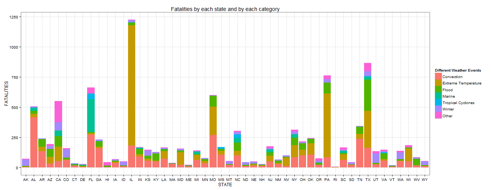
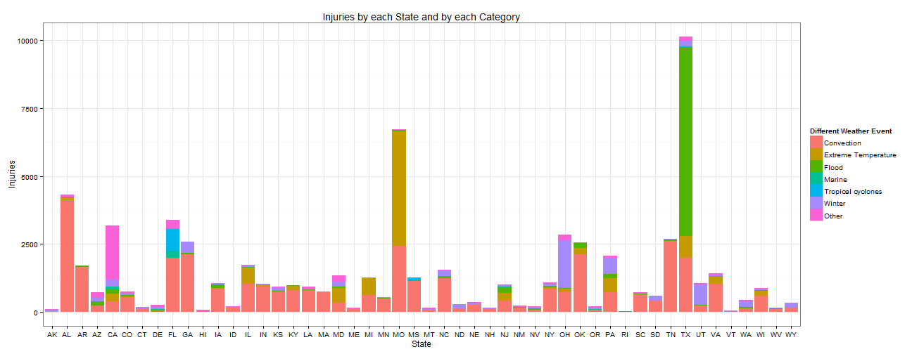
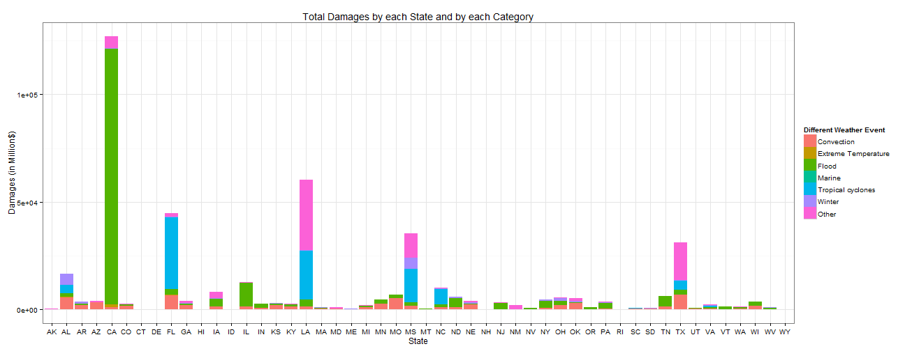

A Thorough analysis on Severe Weather Events and their Impact on Public Health and Financial Aspects which arises from them.
========================================================

# Synopsis.

The analysis has been performed on the National Oceanic and Atmospheric Administration's (NOAA) National Weather Service
which contains the information regarding the major storms and major catastrophic events from the year 1950 to 2011. The main purpose was to explore different kinds of weather events which had most impact on the human's life and severe economic consequences across the United States. The analysis will show the detailed result on the weather events which are responsible for Injuries, Fatalities, and Combined Property and Crop damage across the United States.


# Data Processing
Before loading the data in the memory, make sure the english language is set as your default locale. Below you will find the information about the machine on which this analysis has been performed.

```r
sessionInfo()
```

```
## R version 3.0.2 (2013-09-25)
## Platform: x86_64-w64-mingw32/x64 (64-bit)
## 
## locale:
## [1] LC_COLLATE=English_India.1252  LC_CTYPE=English_India.1252   
## [3] LC_MONETARY=English_India.1252 LC_NUMERIC=C                  
## [5] LC_TIME=English_India.1252    
## 
## attached base packages:
## [1] stats     graphics  grDevices utils     datasets  methods   base     
## 
## other attached packages:
## [1] knitr_1.5
## 
## loaded via a namespace (and not attached):
## [1] digest_0.6.4   evaluate_0.5.3 formatR_0.10   stringr_0.6.2 
## [5] tools_3.0.2
```

### Loading the Data.


```r
download.file("https://d396qusza40orc.cloudfront.net/repdata/data/StormData.csv.bz2", 
    "StormData.csv.bz2", method = "curl")
```

```
## Warning: download had nonzero exit status
```

```r
STORM <- read.csv(bzfile("Storm_Data.csv.bz2"), stringsAsFactors = FALSE)
```


The STORM dataset is huge as it contains 902297 rows and 37 columns.

# Cleaning/Preparing the Data.

The format of the date is not consistant which follows more than one type. so, First we have to create a new variable called "Date" for STORM dataset which has Date int MM/DD/YYYY format.

```r
STORM$Date <- as.Date(STORM$BGN_DATE, format = "%m/%d/%Y")
```

Have a look at the 'propdmgexp' and 'cropdmgexp' variables. They have been represented by the following values-'h|H', 'k|K','m|M' and 'b|B' for Hundread, Thousand, Million and Billion respectively, which are the cash denominations for the 
United States. So we have to process that data such that computation can be performed. We have to change each value to its corresponding numeric form like 'h|H' to 2,'k|K' to 3,'m|M' to 5 and 'b|B' to 9.

* For Property Damage.

```r
STORM$PROPDMGEXP <- sub("h", "2", STORM$PROPDMGEXP, ignore.case = TRUE)
STORM$PROPDMGEXP <- sub("k", "3", STORM$PROPDMGEXP, ignore.case = TRUE)
STORM$PROPDMGEXP <- sub("m", "6", STORM$PROPDMGEXP, ignore.case = TRUE)
STORM$PROPDMGEXP <- sub("b", "9", STORM$PROPDMGEXP, ignore.case = TRUE)
```


* For Crop Damage.

```r
STORM$CROPDMGEXP <- sub("h", "2", STORM$CROPDMGEXP, ignore.case = TRUE)
STORM$CROPDMGEXP <- sub("k", "3", STORM$CROPDMGEXP, ignore.case = TRUE)
STORM$CROPDMGEXP <- sub("m", "6", STORM$CROPDMGEXP, ignore.case = TRUE)
STORM$CROPDMGEXP <- sub("b", "9", STORM$CROPDMGEXP, ignore.case = TRUE)
```


There are many missing values(" ") and some other irrelevent data fields("+", "?", and "-") we need to convert them into
Proper format. Inorder to make this report simple I choose to convert them to 0, otherwise different Imputation techniques can be followed.
* For Crop Damage.

```r
STORM$CROPDMGEXP <- sub("-", "0", STORM$CROPDMGEXP)
STORM$CROPDMGEXP <- sub("\\+", "0", STORM$CROPDMGEXP)
STORM$CROPDMGEXP <- sub("\\?", "0", STORM$CROPDMGEXP)
STORM$CROPDMGEXP <- sub("", "0", STORM$CROPDMGEXP)
```


* For Property Damage.

```r
STORM$PROPDMGEXP <- sub("-", "0", STORM$PROPDMGEXP)
STORM$PROPDMGEXP <- sub("\\?", "0", STORM$PROPDMGEXP)
STORM$PROPDMGEXP <- sub("\\+", "0", STORM$PROPDMGEXP)
STORM$PROPDMGEXP <- sub("", "0", STORM$PROPDMGEXP)
```


Finally we have to convert them into numerical format.

```r
STORM$PROPDMGEXP <- as.numeric(STORM$PROPDMGEXP)
STORM$CROPDMGEXP <- as.numeric(STORM$CROPDMGEXP)
```


Let's calculate the total Crop Damage and Property Damage.


```r
eq <- STORM$PROPDMG * (10^STORM$PROPDMGEXP)
STORM <- cbind(STORM, data.frame(proptotal = eq))
eq <- STORM$CROPDMG * (10^STORM$CROPDMGEXP)
STORM <- cbind(STORM, data.frame(croptotal = eq))
```


### Creation of Categotical Variables.

In the EVETYPE variable, There are many events which cannot be grouped or bucketized. There are just too many of them we need to narrow down them by generalising some of them to a broader category. By exploring on the internet i found a useful way for categorizing them.I came accross the following URL("http://www.nws.noaa.gov/os/hazstats/sum12.pdf"). The National Weather Service makes a detailed analysis for each year. The grouping of the events is performed by considering one of their yearly summary report.

- Convection (Lightning, Tornado, Thunderstorm and Hail).
- Extreme Temperatures (Cold and Heat).
- Flood (Flash flood and River flood).
- Marine (Coastal storm, Tsunami and Rip current).
- Tropical Cyclones (Tropical storm and Hurricane).
- Winter (Winter storm, Ice and Avalanche).
- Other (Drought, Dust storm and etc., ).

Using Regular Expressions we can find events and group into corresponding categorical variable.

```r
rg.convection <- "(NADO)|THUNDERSTORM|TSTM|(\\bTOR\\S+?O\\b|(\\bFUN))|(WIND)|\\bL\\S+?G\\b|(WND)|HAIL"
rg.ex.temp <- "HEAT| COLD| LOW TEMPERATURE|HYPERTHERMIA|HYPOTHERMIA|RECORD HIGH|RECORD LOW|RECORD COLD|UNUSUAL/RECORD WARMTH|RECORD TEMPERATURE |RECORD WARM|TEMPERATURE RECORD|UNSEASONABLY COOL|UNSEASONABLY HOT|UNUSUAL WARMTH|UNUSUALLY WARM|VERY WARM|WARM WEATHER|WARM DRY CONDITIONS"

rg.flood <- "(\\bFL\\S+?D)|PRECIP|RAIN|SHOWER"
rg.marine <- "TSUNAMI|^RIP CUR|^COASTAL(\\s)?STORM$"
rg.tp.cyc <- "^HURRICANE| TROPICAL STORM"
rg.winter <- "(SNOW)|(FREEZ)|(WINT)|AVALAN|FROST|LOW TEMP|BLIZZARD| BLOWING SNOW|(ICE)|(ICY)| FROST | ^HEAVY SNOW| ^SNOW| ^ICE| AVALANCHE | BLIZZARD"
```


```r
sort(unique(grep(rg.convection, STORM$EVTYPE, ignore.case = TRUE, value = TRUE)))
sort(unique(grep(rg.ex.temp, STORM$EVTYPE, ignore.case = TRUE, value = TRUE)))
sort(unique(grep(rg.flood, STORM$EVTYPE, ignore.case = TRUE, value = TRUE)))
sort(unique(grep(rg.marine, STORM$EVTYPE, ignore.case = TRUE, value = TRUE)))
sort(unique(grep(rg.tp.cyc, STORM$EVTYPE, ignore.case = TRUE, value = TRUE)))
sort(unique(grep(rg.winter, STORM$EVTYPE, ignore.case = TRUE, value = TRUE)))
```


Lets now create a new variable for the category of events which we just created and grouped accordingly. Lets name it as EVCategory.

```r
STORM$EVCategory <- rep(0, nrow(STORM))
STORM$EVCategory <- ifelse(grepl(rg.convection, STORM$EVTYPE, ignore.case = TRUE), 
    1, ifelse(grepl(rg.ex.temp, STORM$EVTYPE, ignore.case = TRUE), 2, ifelse(grepl(rg.flood, 
        STORM$EVTYPE, ignore.case = TRUE), 3, ifelse(grepl(rg.marine, STORM$EVTYPE, 
        ignore.case = TRUE), 4, ifelse(grepl(rg.tp.cyc, STORM$EVTYPE, ignore.case = TRUE), 
        5, ifelse(grepl(rg.winter, STORM$EVTYPE, ignore.case = TRUE), 6, 7))))))
# Convert them to factor
STORM$EVCategory <- factor(STORM$EVCategory)
levels(STORM$EVCategory) <- c("Convection", "Extreme.Temperature", "Flood", 
    "Marine", "Tropical.Cyclone", "Winter", "Other")
```

Coming to the Date part, the oldest event recorded in the STORM data set is 

```r
min(STORM$Date)
```

```
## [1] "1950-01-03"
```

and the most recent event was recorded on.

```r
min(STORM$Date)
```

```
## [1] "1950-01-03"
```

When this kind of approach is carried on to each type of weather event, we found that only one type of event(convection) had much older data and the rest  of the events had a short time period  

```r
min(subset(STORM, EVCategory == "Convection")$Date)
```

```
## [1] "1950-01-03"
```

```r
min(subset(STORM, EVCategory != "Convection")$Date)
```

```
## [1] "1993-01-01"
```


In order to maintain a consistant data range among all other weather events we limit ourselves to data which range from 1993 to 2011 years.

```r
STORM_LIMITED <- subset(STORM, Date >= "1993-01-01")
```


# Results

## Fatalities

Inorder to calculate the total fatalities we need to sum them by using the aggregate() function.

```r
total.fatalities <- aggregate(FATALITIES ~ EVCategory + STATE, data = STORM_LIMITED, 
    sum)
```


```r
# barplot(total.fatalities$FATALITIES, names.arg = total.fatalities$STATE)
```

The plot shows other states AM and GU which is a territory of United States. We need to remove them from our analysis. The "states.abb" is a biult-in vector which has all the abbrevations for the 50 US states.

```r
STORM_LIMITED <- subset(STORM_LIMITED, STATE %in% state.abb)
# Recalculating and plotting the total.fatalities
total.fatalities <- aggregate(FATALITIES ~ EVCategory + STATE, data = STORM_LIMITED, 
    sum)
```


```r
# barplot(total.fatalities$FATALITIES, names.arg = total.fatalities$STATE)
```

The Below plot shows what kind of weather events had most number of Fatalities according to each state.

```r
library(ggplot2)
# set the theme.
theme_set(theme_bw())
# plot
ggplot(total.fatalities, aes(x = STATE, y = FATALITIES, fill = EVCategory)) + 
    geom_bar(stat = "identity") + ggtitle("Fatalities by each state and by each category") + 
    labs(x = "STATE", y = "FATALITIES") + theme(legend.position = "right") + 
    scale_fill_discrete("Different Weather Events", labels = c("Convection", 
        "Extreme Temperature", "Flood", "Marine", "Tropical Cyclones", "Winter", 
        "Other"))
```

 

By examining the plot, we infer that.
- The State of Illinois(IL) has the highest number of fatalities, for the major part it was due to extreme temperature. 
- After Illinois(IL), Pennsylvania (PA) had more fatalities and most of them were due to extreme temperature.
- If we look at the big picture, Convection type of weather events seems to be the most responsible for the Fatalities.

Below you will find the table summarizing the total fatalities according to each weather event.

```r
total.fatalities_WE <- aggregate(FATALITIES ~ EVCategory, data = total.fatalities, 
    sum)
total.fatalities_WE
```

```
##            EVCategory FATALITIES
## 1          Convection       3592
## 2 Extreme.Temperature       3292
## 3               Flood       1557
## 4              Marine        528
## 5    Tropical.Cyclone        111
## 6              Winter        875
## 7               Other        601
```


## Injuries.

Comming to Injuries, the same procedure used to calculate the total fatalities can be applied here also.

```r
total.injuries <- aggregate(INJURIES ~ STATE + EVCategory, data = STORM_LIMITED, 
    sum)
# SET THE THEME
theme_set(theme_bw())
# PLOT
ggplot(total.injuries, aes(x = STATE, y = INJURIES, fill = EVCategory)) + geom_bar(stat = "identity") + 
    ggtitle("Injuries by each State and by each Category") + labs(x = "State", 
    y = "Injuries") + theme(legend.position = "right") + scale_fill_discrete("Different Weather Event", 
    labels = c("Convection", "Extreme Temperature", "Flood", "Marine", "Tropical cyclones", 
        "Winter", "Other"))
```

 


By examining the plot, we infer that.
- The state of Texas(TX) has the highest number of Injuries mainly due to the "Flood" kind of weather event.
- After Texas(TX), Missouri(MO) has the second highest number of Injuries manly due to extreme temperature weather event.
- If we look at the big picture, Convection type of weather events seems to be the most responsible for the Injuries.

Below you will find the table summarizing the total fatalities according to each weather event.

```r
total.injuries_WE <- aggregate(INJURIES ~ EVCategory, data = total.injuries, 
    sum)
total.injuries_WE
```

```
##            EVCategory INJURIES
## 1          Convection    37648
## 2 Extreme.Temperature     9142
## 3               Flood     8904
## 4              Marine      473
## 5    Tropical.Cyclone      973
## 6              Winter     6246
## 7               Other     4304
```


# PROPERTY/ CROP DAMAGE

In this section we will assess the total damage in Dollar's for both Property and Crop damage.

```r
# First we need to create a newvariable 'total.loss' which is the result of
# sum of the proptotal and croptotal variable.
STORM_LIMITED$TOTAL.LOSS <- STORM_LIMITED$croptotal + STORM_LIMITED$proptotal
total.damage <- aggregate(TOTAL.LOSS ~ EVCategory + STATE, data = STORM_LIMITED, 
    sum)
# After adding them the result may range from few thousands of dollar to a
# few thousands of million dollars. so we need to scale them. In such way
# that the total losses is represented in the denominations of Million's of
# Dollar.
STORM_LIMITED$TOTAL.LOSS <- (STORM_LIMITED$croptotal + STORM_LIMITED$proptotal)/1e+06
total.damage <- aggregate(TOTAL.LOSS ~ EVCategory + STATE, data = STORM_LIMITED, 
    sum)
# Lets set the Theme.
theme_set(theme_bw())
# PLOT
ggplot(total.damage, aes(x = STATE, y = TOTAL.LOSS, fill = EVCategory)) + geom_bar(stat = "identity") + 
    ggtitle("Total Damages by each State and by each Category") + labs(x = "State", 
    y = "Damages (in Million$)") + theme(legend.position = "right") + scale_fill_discrete("Different Weather Event", 
    labels = c("Convection", "Extreme Temperature", "Flood", "Marine", "Tropical cyclones", 
        "Winter", "Other"))
```

 

By examining the plot, we infer that.
- The state of California(CA) has suffered more Property and Crop Damage mainly due to "Flood" type of event.
- After California(CA), Florida(FL) has the second highest number of Injuries manly due to Tropical Cyclones weather event.
- If we look at the big picture, Flood type of weather events seems to be the most responsible for both Property and Crop Damage.


```r
total.damage_WE <- aggregate(TOTAL.LOSS ~ EVCategory, data = total.damage, sum)
total.damage_WE
```

```
##            EVCategory TOTAL.LOSS
## 1          Convection   68102.18
## 2 Extreme.Temperature    2391.80
## 3               Flood  184053.47
## 4              Marine      63.21
## 5    Tropical.Cyclone   87378.06
## 6              Winter   19684.63
## 7               Other   80718.62
```


Author: Akhil Kumar Ramasagaram.
